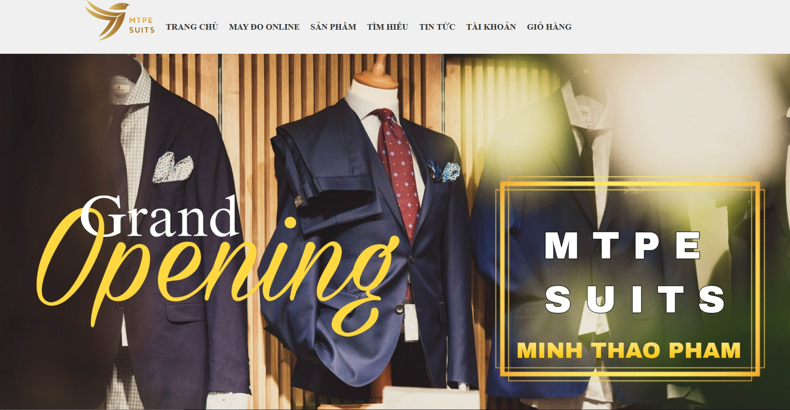

# MTPE SUITS BASIC – HTML CSS JS

## Giới thiệu

Đây là dự án Web UI cho thương hiệu **MTPE SUITS**, cung cấp trải nghiệm mua sắm, may đo suit online, cùng với các chức năng quản lý tài khoản, giỏ hàng, và xem tin tức thời trang.

## Cấu trúc dự án

- **index.html**: Trang chủ giới thiệu thương hiệu và các sản phẩm nổi bật.
- **HTML/**: Thư mục chứa các trang chức năng như:
  - `products.html`: Danh sách sản phẩm
  - `product-detail.html`: Chi tiết sản phẩm
  - `register.html`: Trang đăng ký tài khoản
  - `cart.html`: Trang giỏ hàng
  - `news.html`: Tin tức thương hiệu
  - `thank-you.html`: Trang cảm ơn sau khi đặt hàng
- **CSS/**: Các file định dạng giao diện riêng cho từng trang, đảm bảo phong cách nhất quán và tương thích nhiều thiết bị.
- **JS/**: Các file JavaScript xử lý hiệu ứng, sự kiện người dùng và logic giao diện.
- **Images/**: Chứa ảnh sản phẩm, logo, banner, icon mạng xã hội, v.v.
- **Background.png**: Hình nền chính dùng cho banner hoặc header của trang web.

## Hướng dẫn sử dụng

1. **Mở trang chủ**  
   Mở file `index.html` bằng trình duyệt để bắt đầu trải nghiệm giao diện.

2. **Chức năng chính**
   - Xem danh sách và chi tiết các mẫu suit.
   - Đăng ký tài khoản người dùng.
   - Thêm sản phẩm vào giỏ hàng và thực hiện thanh toán.
   - Cập nhật các tin tức thời trang mới nhất từ MTPE SUITS.

3. **Chạy trên local**
   - Clone hoặc tải về dự án từ GitHub.
   - Mở các file `.html` trực tiếp bằng trình duyệt (khuyến nghị Chrome hoặc Edge).
   - Không yêu cầu server, toàn bộ là client-side.

## Công nghệ sử dụng

- **HTML5**: Cấu trúc nội dung website.
- **CSS3**: Thiết kế giao diện hiện đại và responsive cho mọi thiết bị.
- **JavaScript**: 
  - Vanilla JS để xử lý tương tác người dùng.
  - jQuery (nếu có) để hỗ trợ kiểm tra form và hiệu ứng DOM.
- **Google Fonts**: Tăng tính thẩm mỹ với font chữ đẹp.

## Tác giả

- **Phạm Minh Thảo**  
  [GitHub – Trunks-Pham](https://github.com/Trunks-Pham)
